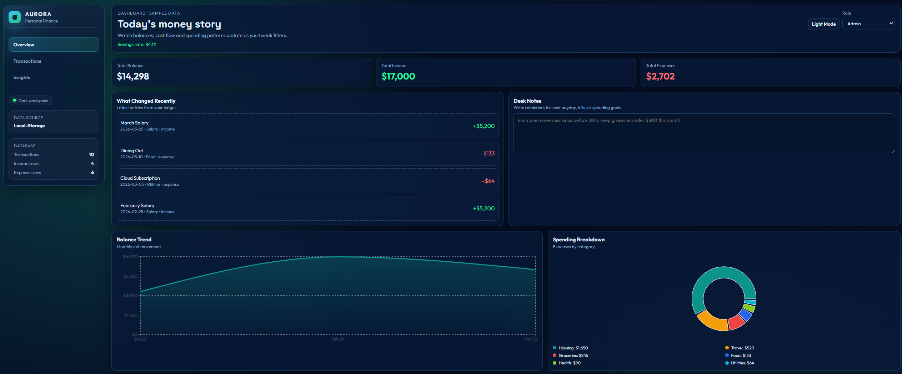

# Finance Dashboard UI

A responsive finance dashboard built with React and Vite. It visualizes balances, income, expenses, and spending patterns with interactive charts, transaction controls, role-based UI, local storage persistence, export support, and a mock API-style data bootstrap.

## Screenshots




## Tech Stack

- React
- Vite
- Recharts
- Plain CSS

## Features

- Summary cards for total balance, income, and expenses
- Time-based chart for balance trend
- Categorical chart for spending breakdown
- Transaction table with search, filtering, sorting, and grouping
- Viewer/Admin role toggle with edit controls for admins
- Insights panel for spending observations
- Dark mode with saved preference
- Local storage persistence for data, notes, role, and theme
- CSV and JSON export for filtered transactions
- Smooth transitions and responsive layout

## Getting Started

```bash
npm install
npm run dev
```

To build for production:

```bash
npm run build
```

## Project Structure

```text
src/
  App.jsx
  App.css
  index.css
  main.jsx
```

## Notes

- The project uses mock data and does not require a backend.
- Charts and transaction insights are based on frontend state.
- Data is persisted locally so the dashboard feels like a real working app.
